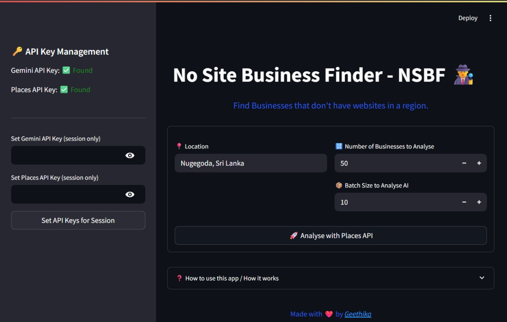
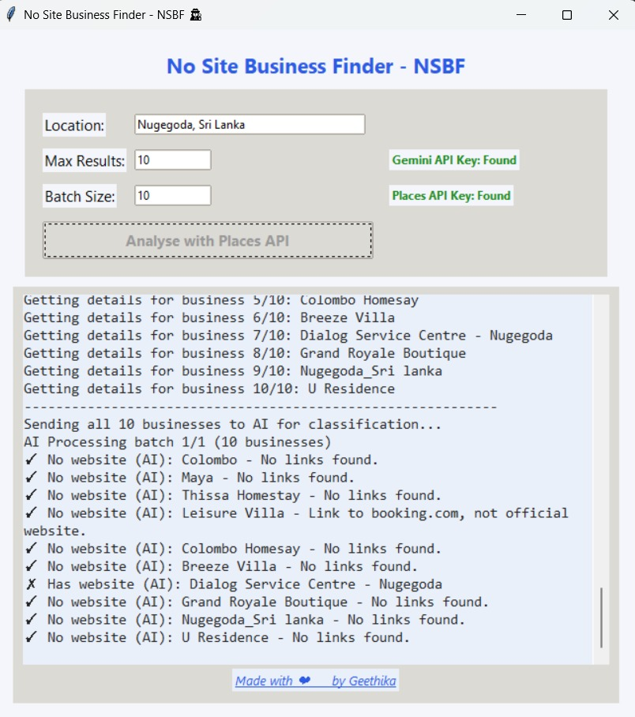

# No Site Business Finder - NSBF

**Find Businesses that don't have websites in a region.**

---

## 🚀 Overview

No Site Business Finder (NSBF) is an open-source tool that helps you discover businesses in any region that do **not** have a website, using the Google Places API and Gemini AI for robust detection. It's perfect for marketers, agencies, and entrepreneurs looking for digitalization opportunities.

### LIVE URL
https://nositebusinessfinder.streamlit.app/
---

## ✨ Features
- 🌍 Search for businesses in any location
- 🧠 Uses Google Places API and Gemini AI for accurate website detection
- 📦 Batch processing for large regions
- 📋 Download results as TXT or CSV
- 🔑 API key status indicators
- 📊 Real-time logs and progress bar
- 🎨 Beautiful UI (Streamlit Web App and Tkinter GUI)
- ❤️ MIT Open Source

---

## 🖥️ Installation

1. **Clone the repository**
   ```bash
   git clone https://github.com/yourusername/no-site-business-finder.git
   cd no-site-business-finder
   ```
2. **Install dependencies**
   ```bash
   pip install -r requirements.txt
   ```
3. **Set up your API keys**
   Create a `.env` file in the project root with:
   ```
   GEMINI_API_KEY=your_gemini_api_key
   GOOGLE_PLACES_API_KEY=your_google_places_api_key
   ```

---

## 🌐 Streamlit Web App (Recommended)


### How to Run
```bash
streamlit run app.py
```

### How to Use
1. **Set your API keys** in the sidebar if not already set (session only or via .env).
2. **Enter a location** (e.g., city, region, or address).
3. **Choose the number of businesses** to analyse and the AI batch size.
4. Click **"Analyse with Places API"** 🚀
5. Watch the log for progress and download your results when done!
6. Expand the **"How to use this app / How it works"** section for a quick tutorial.

#### Screenshot


---

## 🖥️ Classic GUI App (Tkinter)

### How to Run
```bash
python main_gui.py
```

### How to Use
1. **Set your API keys** in the `.env` file before launching.
2. **Enter the location, max results, and batch size** in the input fields.
3. Click **"Analyse with Places API"**.
4. Watch the log area for progress and results.
5. Downloaded results will be saved as TXT and CSV in the project folder.

#### Screenshot


---

## 📦 Requirements
All dependencies for both versions are listed in `requirements.txt`.

---

## 👨‍💻 About the Creator

Hi! I'm Geethika Isuru, an AI Engineer & Entrepreneur who's trying to make a better world with AI.

- 💼 [LinkedIn Profile](https://www.linkedin.com/in/geethikaisuru/)
- 📂 [GitHub Profile](https://github.com/geethikaisuru)
- 🛜 [Website](https://geethikaisuru.com)

---

## 📄 License

This project is licensed under the MIT License. See [LICENSE](LICENSE) for details. 